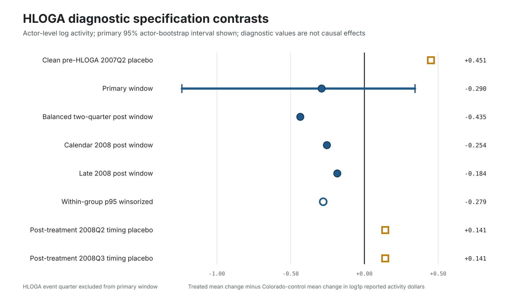

# HLOGA Substitution Estimation Diagnostics

## Technical Summary

**Verdict: `effect_model_and_falsification_gates_not_cleared`.** The panel is usable for a reproducible descriptive contrast and for diagnosing why the design fails, but it does not survive the effect-model and falsification gates. The current rows cannot identify a causal HLOGA effect or cross-channel substitution.

The primary actor-level contrast is `-0.289940` log points (mechanically `-25.2%` after exponentiation), with a deterministic actor-bootstrap 95% interval of `[-1.237307, 0.343357]`. The interval crosses zero. More importantly, treatment is perfectly confounded with source and jurisdiction, federal LDA amounts and Colorado lobbyist-income transactions are not the same outcome, the issue taxonomies are not comparable, only two clean pre-treatment quarters exist, the sole clean placebo duplicates the one-step pre-trend contrast, and one actor omission reverses the descriptive sign.

This packet therefore supports a negative result about design readiness: the source products are ready enough to expose the model's failure modes, not ready enough to estimate substitution.

## The Descriptive Contrast Is Negative but Not Stable Enough for Inference

The figure compares the primary window, alternative windows, p95 winsorization, and timing placebos on the same log-activity scale. The primary bootstrap interval is shown as a horizontal whisker. Window estimates retain the same sign, but the only clean pre-HLOGA placebo is larger and opposite in sign, the primary interval crosses zero, and leave-one-actor results include a sign reversal. These patterns are useful as diagnostics; they do not establish an effect.

The quarter-by-quarter trajectory is saved as a table rather than a line chart because excluding the HLOGA-straddling quarter leaves only seven clean temporal points, too few for a strong trend visual.

## Structural Design Gates Fail Before Causal Interpretation

| Gate | Result | Evidence | Consequence |
| --- | --- | --- | --- |
| Treatment is separable from source system | `fail` | treatedSources=Official LDA API; controlSources=Colorado Secretary of State lobbyist income data; sharedSources=none | Treatment status is perfectly confounded with source and jurisdiction, so time-varying reporting changes are inseparable from the contrast. |
| Treated and control outcomes share a measurement definition | `fail` | treatedOutcome=federal LDA reported lobbying amount; controlOutcome=Colorado state-lobbyist income transaction amount | Federal LDA reported amounts and Colorado lobbyist-income transactions are not the same outcome process. |
| Actor-issue-quarter unit is estimable | `fail` | treatedIssueCodes=36; controlIssueCodes=7; sharedIssueCodes=0 | LDA issue codes and Colorado business/industry labels have no shared reviewed issue taxonomy, so the estimator falls back to actor-quarter. |
| Clean pre-trend depth | `fail` | cleanPreQuarters=2; minimum=3; eventQuarter=2007Q3 excluded because it straddles 2007-09-14 | Two clean quarters permit one pre-period contrast but not a credible trend-shape assessment. |
| Independent clean placebo-date depth | `fail` | independentCleanPlaceboDates=1; minimum=2; the only clean placebo is the same Q1-to-Q2 contrast used for the one-step pre-trend check | The committed time window cannot supply multiple independent, uncontaminated placebo dates. |

The control cohort is an unaffected-jurisdiction source surface, not a matched untreated cohort. Because every treated observation comes from federal LDA and every control observation comes from Colorado state lobbying, source-system changes are mathematically indistinguishable from treatment-group changes. HLOGA also coincides with the LDA shift from semiannual to quarterly filing periods on the treated side, which makes timing comparability especially fragile.

The panel also lacks treated-actor alternate-channel outcomes. It can compare reported activity trajectories, but it cannot calculate a substitution elasticity because it does not observe where treated actors redirected influence.

## Scope, Data, and Metric Definitions

- Treated cohort: `8` exact-name-matched federal LDA clients.
- Control cohort: `25` Colorado state-lobbying clients selected for observed pre/post coverage.
- Analysis grain: balanced actor-quarter panel with `264` rows.
- Clean pre window: `2007Q1; 2007Q2`.
- Event quarter: `2007Q3`, excluded because it contains the September 14, 2007 treatment date.
- Primary post window: `2007Q4; 2008Q1; 2008Q2; 2008Q3; 2008Q4`.
- Outcome: `log1p` of quarterly reported activity dollars. This transform reduces scale leverage but does not make the two source definitions equivalent.
- Estimand: mean actor-level post-minus-pre change among treated actors minus the corresponding mean among controls.
- Prepared panel: `data/calibration/first-wave/substitution-estimation-panel.csv`.

Absent actor-quarter transactions are represented as zero activity. That produces a balanced computational panel, but it is not proof that every zero is a verified no-activity observation.

## Filing and Transaction Cleaning Prevents Mechanical Inflation

- LDA issue rows: `602` input rows collapsed to `239` filing UUIDs; `363` repeated issue rows removed from amount aggregation.
- LDA filing versions: `23` registration filings excluded and `19` superseded filing versions removed, leaving `197` selected filings.
- Colorado transactions: `9` rows in `9` repeated receipt-key groups were collapsed from `1105` source rows. All `9` repeated groups differ in report-month metadata, so the rule prevents likely receipt double counting but is not proof of source-record supersession.
- Semiannual 2007 LDA amounts are allocated to covered quarters in proportion to calendar days. This avoids counting a six-month amount twice, but it does not create independent monthly or quarterly observations.

## Estimator and Uncertainty

For each actor, the script computes the mean transformed outcome in the selected post window minus the mean in the selected pre window. The diagnostic estimate is the treated-group mean change minus the control-group mean change. Uncertainty is summarized with a deterministic actor-level percentile bootstrap that resamples actors within each group. The committed run uses `10,000` repetitions and base seed `20070914`; specification-specific seeds are deterministic offsets from that base. No p-value is promoted because treatment assignment is not exchangeable across the source-confounded cohorts.

The event-study table normalizes each actor to its 2007Q1-2007Q2 mean. It includes the event quarter for audit but marks that quarter as excluded from the primary contrast.

## Falsification and Sensitivity Checks Do Not Clear the Design

| Check | Pre window | Post window | Estimate | 95% actor bootstrap | Status |
| --- | --- | --- | ---: | --- | --- |
| Primary window | 2007Q1; 2007Q2 | 2007Q4; 2008Q1; 2008Q2; 2008Q3; 2008Q4 | -0.289940 | [-1.237307, 0.343357] | `diagnostic_only` |
| Balanced two-quarter post window | 2007Q1; 2007Q2 | 2007Q4; 2008Q1 | -0.434585 | [-1.474144, 0.306892] | `direction_stable_diagnostic` |
| Calendar 2008 post window | 2007Q1; 2007Q2 | 2008Q1; 2008Q2; 2008Q3; 2008Q4 | -0.254171 | [-1.192506, 0.381902] | `direction_stable_diagnostic` |
| Late 2008 post window | 2007Q1; 2007Q2 | 2008Q3; 2008Q4 | -0.183729 | [-1.155481, 0.462629] | `direction_stable_diagnostic` |
| Within-group p95 winsorized | 2007Q1; 2007Q2 | 2007Q4; 2008Q1; 2008Q2; 2008Q3; 2008Q4 | -0.279172 | [-1.244875, 0.348046] | `direction_stable_diagnostic` |
| Clean pre-HLOGA 2007Q2 placebo | 2007Q1 | 2007Q2 | 0.450966 | [-0.073216, 1.380036] | `does_not_reassure` |
| Post-treatment 2008Q2 timing placebo | 2007Q4; 2008Q1 | 2008Q2; 2008Q3 | 0.141151 | [-0.061077, 0.322168] | `post_treatment_timing_sensitivity_only` |
| Post-treatment 2008Q3 timing placebo | 2008Q1; 2008Q2 | 2008Q3; 2008Q4 | 0.140882 | [-0.283475, 0.689286] | `post_treatment_timing_sensitivity_only` |

The sole clean pre-HLOGA placebo is `0.450966` log points, opposite in sign to the primary estimate. It is also numerically the same Q1-to-Q2 contrast used by the one-step pre-trend diagnostic, so it is not independent falsification evidence.

Leave-one-actor estimates range from `-0.343165` to `0.111013`. Sign reversals: `1`. The sign reversal occurs when omitting `JEFFERSON COUNTY JUSTICE SERVICES DIVISON`.

## What the Current Design Can and Cannot Support

It can support:

- an auditable actor-quarter preparation layer over the committed treated and control source rows;
- a descriptive comparison of transformed reported-activity changes across those cohorts;
- concrete evidence that source comparability, pre-period depth, placebo depth, uncertainty, and influence diagnostics remain inadequate;
- prioritization of the next source and design upgrades.

It cannot support:

- a claim that HLOGA caused lobbying activity to rise or fall;
- a cross-channel substitution elasticity or a claim that influence moved into a particular alternate venue;
- hidden-channel magnitudes, national prevalence, or representative policy effects;
- calibration of simulator policy-effect parameters from this contrast.

## Recommended Next Steps

1. Add unaffected federal LDA actors or provision-level exposure variation so treated and comparison observations share a source and outcome definition.
2. Extend both cohorts backward to provide at least eight clean pre-treatment quarters and multiple uncontaminated placebo dates.
3. Build a reviewed common issue taxonomy and estimate at actor-issue-quarter rather than actor-quarter.
4. Add observed alternate-channel outcomes for the treated actors; without them, the design cannot estimate substitution.
5. Validate LDA filing-version rules and explicitly model the HLOGA-linked change from semiannual to quarterly reporting.
6. Re-run this packet and require every structural, pre-trend, placebo, uncertainty, window, outlier, and leave-one-actor gate to clear before requesting external causal review.

## Further Questions

- Which HLOGA provisions generated plausibly heterogeneous exposure among otherwise comparable LDA clients?
- Can unaffected issue families within federal LDA provide a stronger control than a different jurisdiction and source system?
- Which alternate public influence channels can be linked to the same treated actors before and after the reform?
- Can filing amendments be resolved against official supersession identifiers rather than latest-posted heuristics?

## Regeneration

Run `make substitution-estimation-diagnostics substitution-causal-upgrade-packet paper-artifacts-check`. Supporting audit tables are `reports/substitution-estimation-diagnostics.csv`, `reports/substitution-estimation-event-study.csv`, and `reports/substitution-estimation-leave-one-actor.csv`.

Claim boundary: `Descriptive source-confounded HLOGA panel diagnostics only; no causal substitution effect, hidden-channel magnitude, policy calibration, or national generalization.`

- Generated at: `2026-06-19T00:00:00Z`
- Release tag: `paper-publication-readiness-2026-06-19-r208`
- Release date: `2026-06-19`
